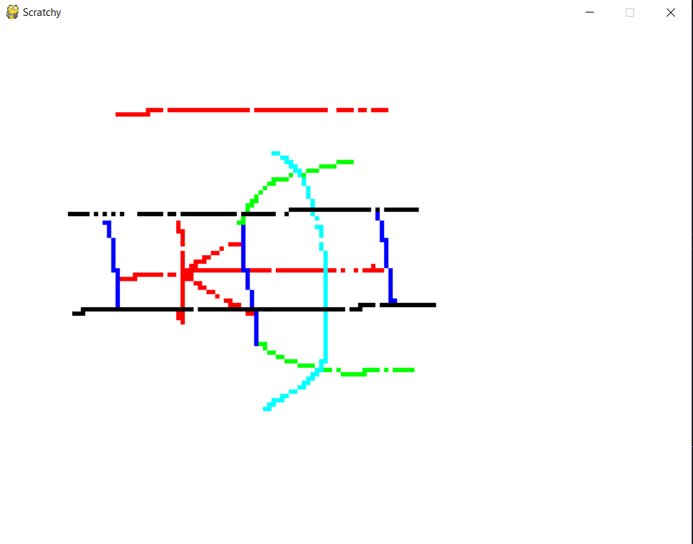

# Scratchy
**Scratchy** is a useful mini version of paint where one can draw anything.

## Working:
The whole canvas is treated like a *grid* containing of *cells*. So the *cell* is filled with colors when clicked at its boundary.
A *cheat* system is implemented to change colors for the time being.

## Demo

