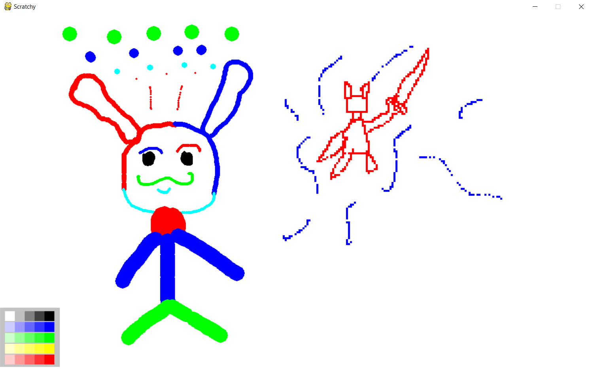
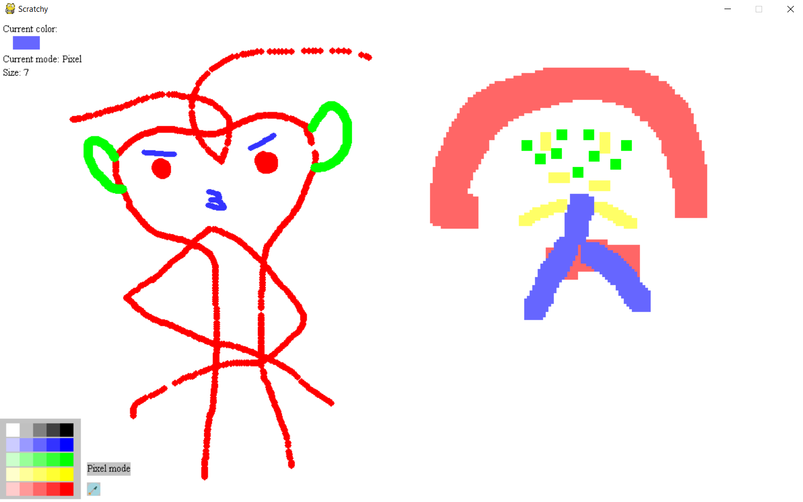

# Scratchy
**Scratchy** is a useful mini version of paint where one can draw anything made using pygame.

## Working
There are two modes:
1. Free drawing mode
*In this mode, a pencil is activated. Size can vary from 2 to 15.(+ to increase, - to decrease)\
2. Pixel mode
*A grid system is activated consisting of cells. So when once clicks at a certain position, the cell covering that position will be filled.\

### Keys
1. Spacebar = Eraser
2. Numpad + sign = increase size
3. Numpad - sign = decrease size

## Demo

### RIP Cheat system (Aug 15 - Aug 17)
For the time being, a cheat system is utilized. TO change the color or the mode, a cheat should be entered.\
    * 'cr' = 'change color to red'\
    * 'cb' = 'change color to blue'\
    * 'ckb' = 'change color to black'\
    * 'cg' = 'change color to green'\
    * 'cc' = 'change color to cyan'\
    * 'mpi' = 'change to pixel mode'\
    * 'mdp' = 'change to free drawing pencil mode'

